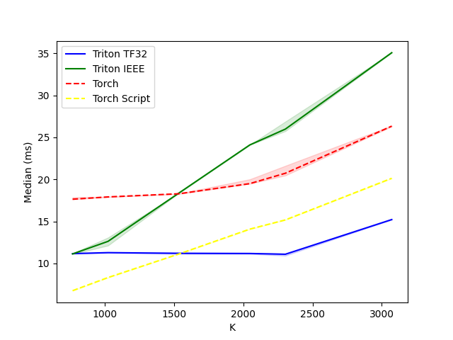

# FISTA.Triton (Experimental)

A Triton implementation of FISTA (Fast Iterative Shrinkage-Thresholding Algorithm, [1]).
The original PyTorch implementation is made by [yubeic](https://github.com/yubeic/Sparse-Coding/).

# Usage

```bash
pip install git+https://github.com/ficstamas/fista.triton.git
```

```python
from fista.fista_triton import fista_triton
from fista.utils import set_seed
import torch


set_seed(0)
inp = torch.randn((512, 768), dtype=torch.float32, device='cuda')
dictionary = torch.randn((768, 3072), dtype=torch.float32, device='cuda')

# if eta is not provided then the following two lines will be used to estimate it
lips = torch.linalg.eigvalsh(dictionary.t() @ dictionary)[-1]
eta = (1. / lips).detach().cpu().item()

fista_triton(
    inp, dictionary, 100, 0.1,
    eta=eta, normalize_vectors=True, verbose=False, input_precision="tf32"
)
```

# Benchmarks

Evaluated the implementation on several parameters, and the latency is measured in a 4080 SUPER. 
If you want to reproduce the results, both script can be found at the root of the repository.

We are measuring 100 repeated runs, after 100 warmup steps, and reporting the median value with the `[20, 80]` percentiles.

## Effect of iterations

- Input embedding has a shape of `(512, 768)`
- Fixed the number of basis to `3072`


## Effect of basis

- Input embedding has a shape of `(512, 768)`
- Fixed the number of iterations to `100`



# Related Work

[1] Beck, A. & Teboulle, M. (2009). A Fast Iterative Shrinkage-Thresholding Algorithm for Linear Inverse Problems. SIAM Journal on Imaging Sciences, 2, 183--202. doi: 10.1137/080716542 